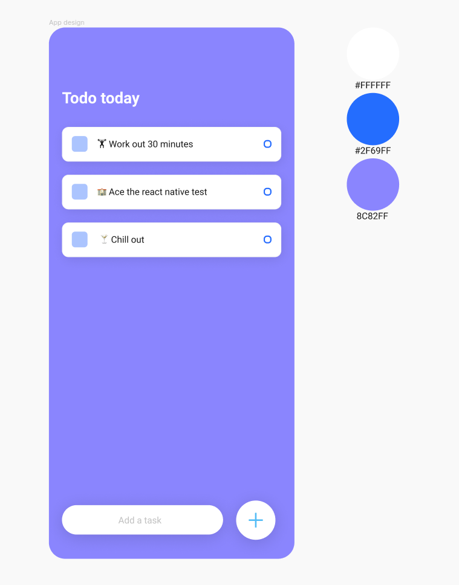

# react native todo list
Simple react native todolist showcase

## Key project objectives
- Project setup with Expo + dependancies
- Create app from design
- Pass props & manage state

## What we're building

https://www.figma.com/file/53Saq8UIYvgFJO0g5yuuZZ/React-Native-Todo-List?node-id=0%3A1

# Diiage DI3P4 - React native practice 
## Project setup 
1. Fork the current repository using your own Github account
2. Clone the forked repo to your workspace `git clone 
3. We're going to use Expo, if you do not have expo cli installed, install it now using `npm install --global expo-cli`
4. Initiate app using `expo init todoList`
    - Select a blank template (blank - a minimal app as clean as an empty canvas) - dependancies will now install
5. Move into created project `cd todoList`
    - Run `npm run start` to launch the expo project

## Part 1 - Build "Todo today" section 
Start by opening the App.js file in your project root.

1. Empty the default View to have something like this : 
```jsx
export default function App() {
  return (
    <View style={styles.container}>
      
    </View>
  );
}

const styles = StyleSheet.create({
  container: {
    flex: 1,
    backgroundColor: '#fff',
  },
});
```

2. Add a `<View>` Component that will contain The today's tasks section
3. In that view
    - Add a `<Text>` Component that show's the "Todo today" label
    - Add another `<View>` that will contain the tasks
4. Add styles for your new components
    - Add style classes to the existing stylesheet 
    - Change the background to design color
    - The task section has a paddingTop of 80, and a paddingHorizontal of 20
    - The title has a fontSize of 24 and is bold
```jsx
{/* Todo today section */}
export default function App() {
  return (
    <View style={styles.container}>

      {/* Todo today section */}
      <View style={styles.tasksSection}>
      ...
      </View>
    </View>
  );
}

const styles = StyleSheet.create({
  container: {
    flex: 1,
    backgroundColor: "#8C82FF",
  },
  tasksSection: {
    paddingTop: 80,
    paddingHorizontal: 20,
  },
  ...
});
```

5. Create a reusable component that corresponds to a Task
    - create a components/ directory in your project
    - Add the Task.js component file, use the boostrap detailed below
    - Build the component using the design details in the figma link https://www.figma.com/file/53Saq8UIYvgFJO0g5yuuZZ/React-Native-Todo-List?node-id=0%3A1

```jsx 
import React from "react";
import { View, Text, StyleSheet, TouchableOpacity } from "react-native";

const Task = () => {
  return (
    <View style={styles.item}>
      <View style={styles.itemLeft}>
        <View style={styles.square}></View>
        <Text style={styles.itemText}>This is a task</Text>
      </View>
      <View style={styles.circular}></View>
    </View>
  );
};

const styles = StyleSheet.create({
  item: {
      ...
  },
  itemLeft: {
    flexDirection: "row",
    alignItems: "center",
    flexWrap: "wrap",
  },
  square: {
      ...
  },
  itemText: {
    maxWidth: "80%",
  },
  circular: {
      ...
  },
});

export default Task;
```

6. Use the `<Task />` Component in your App.js
7. Add a prop to your task component to pass a specific text to show
8. You should now have a task that is correclty shown in your view.
9. Commit your changes with the comment `feat(task): added task section and task component`

## Part 2 - Build "Add task" section 
1. In your App.js, use the `<KeyboardAvoidingView>` component, which ensures the keyboard does not cover the items on screen.
2. Add the input using `<TextInput>`
    - create a state for the task being added using the useState hook
    - Connect the value et onChangeText to the task state
3. Use a `<TouchableOpacity>` component to create the + button
    - Add the necessary nested components (View/Text)
    - connect the `onPress` event of `<TouchableOpacity>` to a function that will handle the addTask code
    - Code the addTask() function, it should : 
        - add the currently written task to a list of tasks, 
        - empty the state of current task, 
        - and hide the keyboard
4. Loop on the list of tasks to display them using the `<Task />` component built earlier (ex: using a .map() operator)
5. You should now be able to add a task to the list of tasks and display them
6. Commit your changes with the comment `feat(new task): add new task section`

### Part 3 - Completing a task
1. In your App.js, wrap the `<Task />` component in a `<TouchableOpacity>` component to be able to detect an `onPress` event
2. Connect that event to a function that will splice the finished task from the state containing the list of tasks.
3. You're done!
4. Commit your changes with the comment `feat(finish task): added task completion`
5. Push your changes to Github and communicate your Repo URL